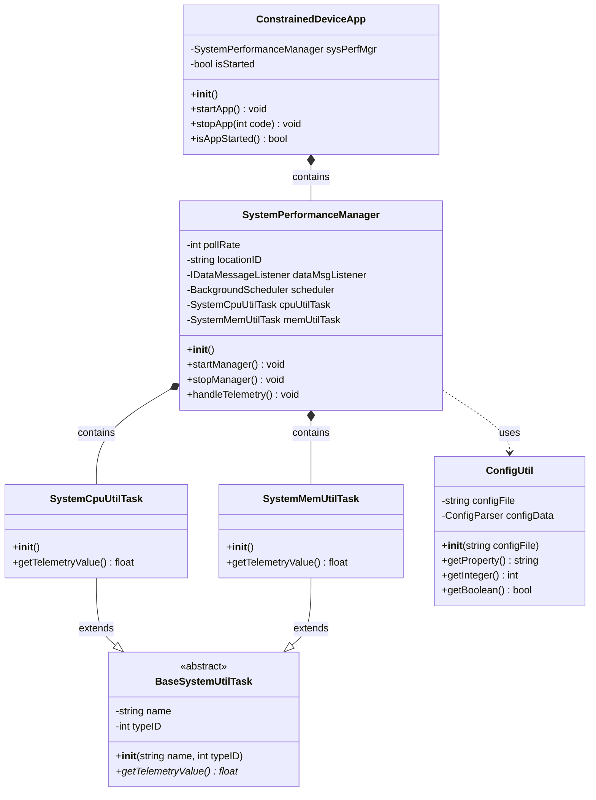

# Constrained Device Application (Connected Devices)

## Lab Module 02

Be sure to implement all the PIOT-CDA-* issues (requirements) listed at [PIOT-INF-02-001 - Lab Module 02](https://github.com/orgs/programming-the-iot/projects/1#column-9974938).

### Description

NOTE: Include two full paragraphs describing your implementation approach by answering the questions listed below.

What does your implementation do? 

My implementation creates the foundation of the Constrained Device Application (CDA), a Python-based IoT application for resource-limited devices. The CDA monitors system performance through the SystemPerformanceManager class, which runs two tasks: SystemCpuUtilTask for CPU monitoring and SystemMemUtilTask for memory monitoring. These tasks collect system data every 5 seconds by default. The application starts up, runs the monitoring tasks for a set time period, then shuts down cleanly.

How does your implementation work?

The ConstrainedDeviceApp is the main class that starts everything. When it runs, it creates a SystemPerformanceManager and calls startManager(). The manager uses Python's APScheduler library to run handleTelemetry() every few seconds. This method gets CPU usage from SystemCpuUtilTask (using psutil.cpu_percent()) and memory usage from SystemMemUtilTask (using psutil.virtual_memory().percent). Both tasks inherit from BaseSystemUtilTask and implement getTelemetryValue(). Settings like how often to check system stats come from the PiotConfig.props file through ConfigUtil. Everything gets logged using Python's logging module so you can see what's happening.

### Code Repository and Branch

NOTE: Be sure to include the branch (e.g. https://github.com/programming-the-iot/python-components/tree/alpha001).

URL: https://github.com/PsychicMoose/cda-python-components/tree/labmodule02

### UML Design Diagram(s)

NOTE: Include one or more UML designs representing your solution. It's expected each
diagram you provide will look similar to, but not the same as, its counterpart in the
book [Programming the IoT](https://learning.oreilly.com/library/view/programming-the-internet/9781492081401/).

### Unit Tests Executed
NOTE: TA's will execute your unit tests. You only need to list each test case below
(e.g. ConfigUtilTest, DataUtilTest, etc). Be sure to include all previous tests, too,
since you need to ensure you haven't introduced regressions.

-test_ConfigUtilDefault (from Lab Module 01)
-test_ConfigUtilCustom (from Lab Module 01)
-test_SystemPerformanceManager 
-test_ConstrainedDeviceApp
-test_SystemMemUtilTask
-test_SystemCpuUtilTask

### Integration Tests Executed

NOTE: TA's will execute most of your integration tests using their own environment, with
some exceptions (such as your cloud connectivity tests). In such cases, they'll review
your code to ensure it's correct. As for the tests you execute, you only need to list each
test case below (e.g. SensorSimAdapterManagerTest, DeviceDataManagerTest, etc.)

- 
- test_ConstrainedDeviceApp
- test_SystemPerformanceManager

EOF.
