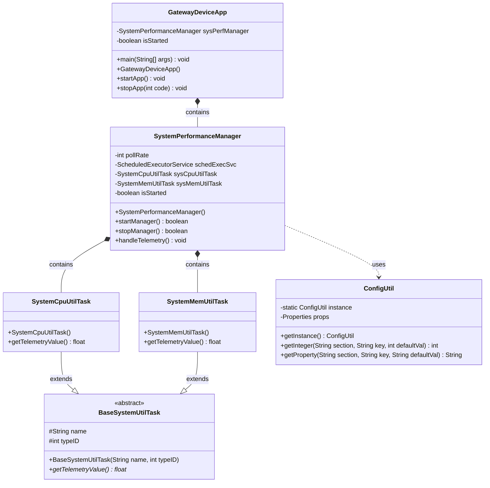

# Gateway Device Application (Connected Devices)

## Lab Module 02

Be sure to implement all the PIOT-GDA-* issues (requirements) listed at [PIOT-INF-02-001 - Lab Module 02](https://github.com/orgs/programming-the-iot/projects/1#column-9974938).

### Description

NOTE: Include two full paragraphs describing your implementation approach by answering the questions listed below.

What does your implementation do? 

The Gateway Device Application (GDA) implementation creates a Java-based IoT gateway that monitors system performance on the host device. It initializes a SystemPerformanceManager that coordinates two monitoring tasks: SystemCpuUtilTask for CPU utilization and SystemMemUtilTask for memory utilization. The application runs for a configured duration (default 65 seconds), collecting system metrics at regular intervals (default every 5 seconds) and logging the results. The GDA serves as a higher-resource tier in the IoT architecture compared to the Constrained Device Application.

How does your implementation work?

The implementation uses a scheduled executor service to periodically run monitoring tasks. When GatewayDeviceApp starts, it creates and starts the SystemPerformanceManager, which initializes a ScheduledExecutorService with a single thread pool. The manager schedules the handleTelemetry() method to run at fixed intervals based on configuration settings loaded through ConfigUtil. Each execution calls getTelemetryValue() on both SystemCpuUtilTask and SystemMemUtilTask, which use Java's ManagementFactory to retrieve system load average and memory usage respectively. The application uses Java's logging framework to output status messages and telemetry data, with configuration parameters read from the PiotConfig.props file.

### Code Repository and Branch

NOTE: Be sure to include the branch (e.g. https://github.com/programming-the-iot/python-components/tree/alpha001).

URL: https://github.com/PsychicMoose/gda-java-components/tree/labmodule02

### UML Design Diagram(s)

NOTE: Include one or more UML designs representing your solution. It's expected each
diagram you provide will look similar to, but not the same as, its counterpart in the
book [Programming the IoT](https://learning.oreilly.com/library/view/programming-the-internet/9781492081401/).

### Unit Tests Executed
NOTE: TA's will execute your unit tests. You only need to list each test case below
(e.g. ConfigUtilTest, DataUtilTest, etc). Be sure to include all previous tests, too,
since you need to ensure you haven't introduced regressions.

-ConfigUtilDefaultTest
-ConfigUtilCustomTest
-SystemCpuUtilTaskTest
-SystemMemUtilTaskTest

### Integration Tests Executed
NOTE: TA's will execute most of your integration tests using their own environment, with
some exceptions (such as your cloud connectivity tests). In such cases, they'll review
your code to ensure it's correct. As for the tests you execute, you only need to list each
test case below (e.g. SensorSimAdapterManagerTest, DeviceDataManagerTest, etc.)

-GatewayDeviceAppTest
-SystemPerformanceManagerTest

EOF.
