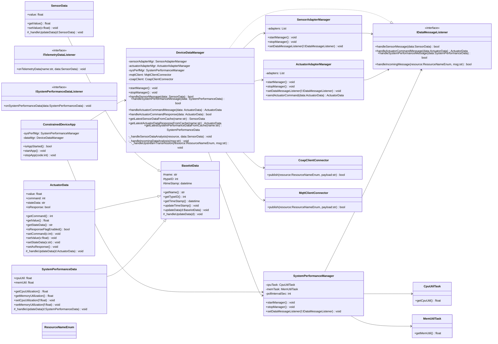

# Constrained Device Application (Connected Devices)

## Lab Module 03

Be sure to implement all the PIOT-CDA-* issues (requirements) listed at [PIOT-INF-03-001 - Lab Module 03](https://github.com/orgs/programming-the-iot/projects/1#column-10488379).

### Description

NOTE: Include two full paragraphs describing your implementation approach by answering the questions listed below.

What does your implementation do? 

How does your implementation work?

My implementation wires up a Constrained Device Application that orchestrates three core subsystems: Sensor acquisition, Actuator control, and System Performance monitoring. ConstrainedDeviceApp bootstraps config, logging, and lifecycle, then delegates the real work to DeviceDataManager. DeviceDataManager stands in the middle as the message hub. It spins up SensorAdapterManager for telemetry, ActuatorAdapterManager for commands and responses, and SystemPerformanceManager for CPU and memory metrics. Data objects (SensorData, ActuatorData, SystemPerformanceData) flow through a common pattern derived from BaseIotData: getters/setters update timestamps, and _handleUpdateData gives me a hook to merge or reconcile data later when I scale up to multi-sensor fusion or confidence weighting.

Under the hood, the CDA uses config flags to enable or disable managers, pushes actuator decisions based on temperature thresholds on-device when configured, and leaves the door open for upstream links through MQTT or CoAP clients. Logging is configured at app start so info and debug actually show up. The design keeps responsibilities tight: managers manage, data models model, the app orchestrates. That separation lets me test each piece in isolation and avoid regressions as I add features in later labs.

### Code Repository and Branch

NOTE: Be sure to include the branch (e.g. https://github.com/programming-the-iot/python-components/tree/alpha001).

URL: https://github.com/PsychicMoose/cda-python-components/tree/labmodule03

### UML Design Diagram(s)

NOTE: Include one or more UML designs representing your solution. It's expected each
diagram you provide will look similar to, but not the same as, its counterpart in the
book [Programming the IoT](https://learning.oreilly.com/library/view/programming-the-internet/9781492081401/).

### Unit Tests Executed

NOTE: TA's will execute your unit tests. You only need to list each test case below
(e.g. ConfigUtilTest, DataUtilTest, etc). Be sure to include all previous tests, too,
since you need to ensure you haven't introduced regressions.

ConfigUtilTest

DataUtilTest

BaseIotDataTest

SensorDataTest

ActuatorDataTest

SystemPerformanceDataTest

SystemPerformanceManagerTest

SensorAdapterManagerTest

ActuatorAdapterManagerTest

### Integration Tests Executed

NOTE: TA's will execute most of your integration tests using their own environment, with
some exceptions (such as your cloud connectivity tests). In such cases, they'll review
your code to ensure it's correct. As for the tests you execute, you only need to list each
test case below (e.g. SensorSimAdapterManagerTest, DeviceDataManagerTest, etc.)

DeviceDataManagerNoCommsTest

ConstrainedDeviceAppStartStopTest

EOF.
