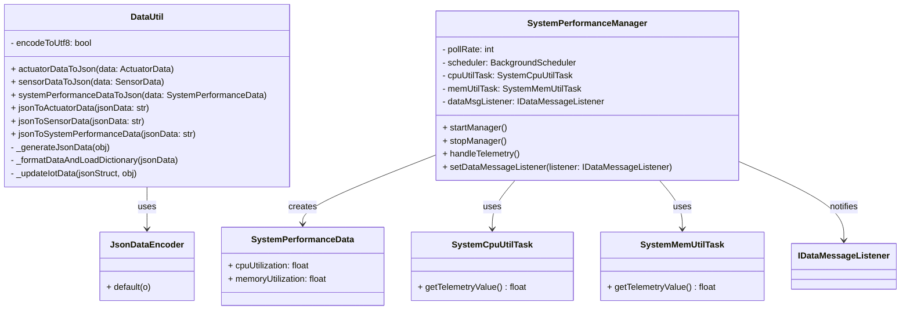

# Constrained Device Application (Connected Devices)

## Lab Module 05

Be sure to implement all the PIOT-CDA-* issues (requirements) listed at [PIOT-INF-05-001 - Lab Module 05](https://github.com/orgs/programming-the-iot/projects/1#column-10488421).

---

### Description

In this module, I implemented two major components of the Constrained Device Application (CDA): **`DataUtil`** ([Issue #63](https://github.com/programming-the-iot/book-exercise-tasks/issues/63)) and **`SystemPerformanceManager`** ([Issue #143](https://github.com/programming-the-iot/book-exercise-tasks/issues/143)). These two modules enhance the CDA’s internal communication and telemetry subsystems by enabling standardized data exchange and automated system performance monitoring.

The **`DataUtil`** class is responsible for serializing and deserializing IoT data objects — `ActuatorData`, `SensorData`, and `SystemPerformanceData` — to and from JSON. This enables consistent data representation across system components and supports network or file-based data transfer. It includes six conversion methods (`toJson` and `fromJson` for each data type), helper utilities for cleaning malformed JSON, and a custom encoder (`JsonDataEncoder`) that handles nested object structures. This ensures a stable and predictable data format throughout the application lifecycle.

The **`SystemPerformanceManager`** class manages real-time telemetry collection for system CPU and memory utilization. It uses the `apscheduler` library to run periodic tasks that invoke `SystemCpuUtilTask` and `SystemMemUtilTask`. Each collected sample is wrapped in a `SystemPerformanceData` object and delivered to any registered listener implementing the `IDataMessageListener` interface (typically the `DeviceDataManager`). This design allows flexible integration with higher-level data processing components and supports configurable polling intervals and controlled start/stop lifecycles.

Together, these implementations complete the foundation for the CDA’s internal data flow pipeline — collecting telemetry, encoding it into portable structures, and enabling downstream communication with the Gateway Device Application (GDA) and cloud layers.

---

### Code Repository and Branch

URL:  
https://github.com/PsychicMoose/cda-python-components/tree/labmodule05

---

### UML Design Diagram(s)

### Unit Tests Executed

NOTE: TA's will execute your unit tests. You only need to list each test case below
(e.g. ConfigUtilTest, DataUtilTest, etc). Be sure to include all previous tests, too,
since you need to ensure you haven't introduced regressions.

- 
- test_DataUtil
- 

### Integration Tests Executed

NOTE: TA's will execute most of your integration tests using their own environment, with
some exceptions (such as your cloud connectivity tests). In such cases, they'll review
your code to ensure it's correct. As for the tests you execute, you only need to list each
test case below (e.g. SensorSimAdapterManagerTest, DeviceDataManagerTest, etc.)

- test_SystemPerformanceManager
- 
- 

EOF.
