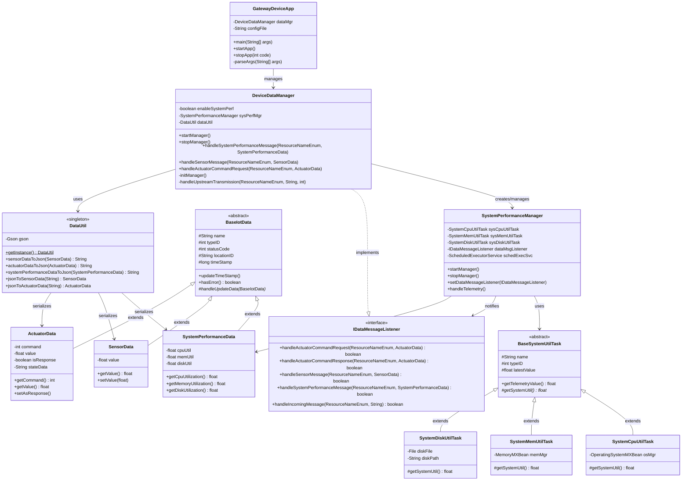

# Gateway Device Application (Connected Devices)

## Lab Module 05

Be sure to implement all the PIOT-GDA-* issues (requirements) listed at [PIOT-INF-05-001 - Lab Module 05](https://github.com/orgs/programming-the-iot/projects/1#column-10488421).

### Description

The implementation creates a comprehensive data management system for the Gateway Device Application (GDA) that collects, processes, and prepares IoT data for transmission. The system implements data containers for sensor readings, actuator commands, and system performance metrics, along with a hierarchical management structure that coordinates data flow between system monitoring components and communication interfaces. The architecture establishes a foundation for handling real-time system telemetry including CPU utilization, memory consumption, and disk usage, while providing JSON serialization capabilities for data interchange with external systems and cloud services.

The implementation works through a layered architecture where the GatewayDeviceApp serves as the main entry point, managing the lifecycle of the DeviceDataManager which acts as the central coordinator for all data processing. The DeviceDataManager instantiates and manages the SystemPerformanceManager, which periodically collects system metrics through specialized utilization tasks (SystemCpuUtilTask, SystemMemUtilTask, and SystemDiskUtilTask) that extend a common BaseSystemUtilTask abstract class. When metrics are collected, they're encapsulated in SystemPerformanceData objects and passed back to the DeviceDataManager through the IDataMessageListener interface callback mechanism. The DataUtil singleton provides JSON serialization/deserialization capabilities using the Gson library, enabling conversion of all data objects to JSON format for future transmission to cloud services or storage systems.

### Code Repository and Branch

URL: https://github.com/PsychicMoose/gda-java-components/tree/labmodule05

### UML Design Diagram(s)

### Unit Tests Executed
    ActuatorDataTest
    SensorDataTest
    SystemPerformanceDataTest
    SystemStateDataTest
    BaseIotDataTest
    DataUtilTest
    SystemCpuUtilTaskTest
    SystemMemUtilTaskTest
    SystemDiskUtilTaskTest
    ConfigUtilTest
### Integration Tests Executed
    SystemPerformanceManagerTest
    DeviceDataManagerNoCommsTest
    GatewayDeviceAppTest
    DataIntegrationTest
    SystemUtilTaskIntegrationTest
EOF.

