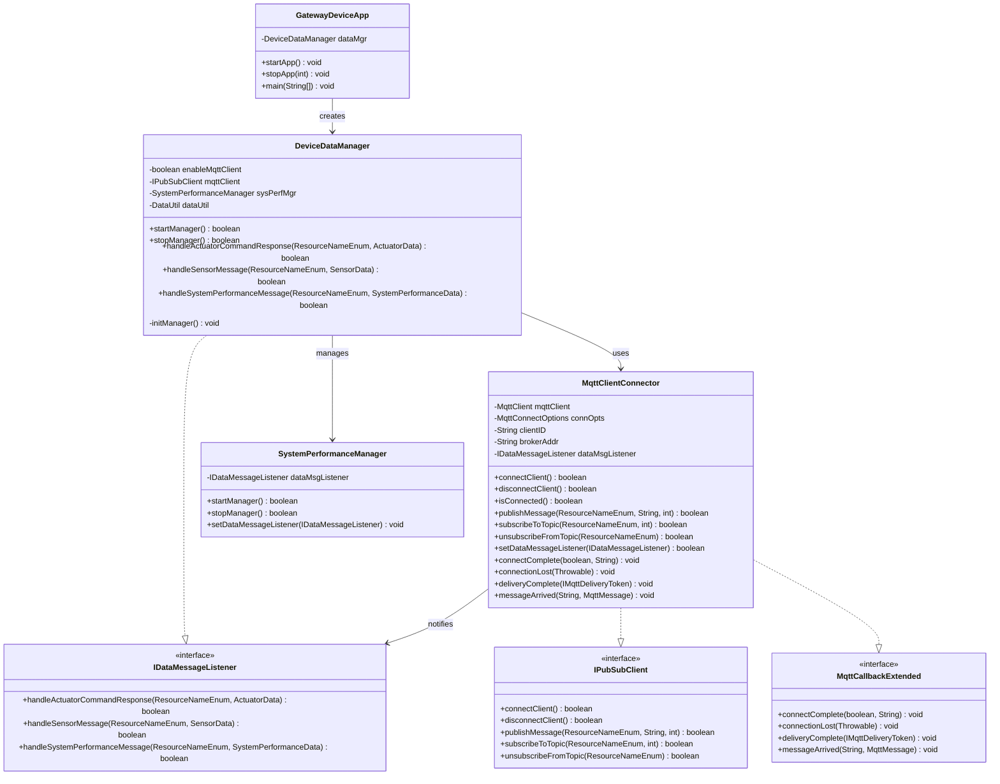

# Gateway Device Application (Connected Devices)

## Lab Module 07

Be sure to implement all the PIOT-GDA-* issues (requirements) listed at [PIOT-INF-07-001 - Lab Module 07](https://github.com/orgs/programming-the-iot/projects/1#column-10488499).

### Description

This implementation integrates MQTT client functionality into the Gateway Device Application (GDA), establishing it as a central hub for IoT device communication. The GDA now connects to an MQTT broker to receive sensor data and system performance metrics from Constrained Device Applications (CDAs), while also publishing actuator commands and management messages. The implementation includes full support for all 14 MQTT 3.1.1 control packets, comprehensive callback handlers for connection events and message arrivals, and automatic subscription management for relevant topics upon connection establishment.

The implementation works through the MqttClientConnector class, which uses the Eclipse Paho Java client library to handle MQTT protocol operations. The DeviceDataManager initializes the MQTT client based on configuration settings, manages the connection lifecycle, and coordinates topic subscriptions for CDA sensor messages, actuator responses, and system performance data. The connector implements the MqttCallbackExtended interface to handle asynchronous events including connection completion, connection loss, message delivery confirmation, and incoming message processing. Quality of Service (QoS) levels 0, 1, and 2 are supported to ensure reliable message delivery based on application requirements. The system includes automatic reconnection capabilities and keep-alive mechanisms to maintain persistent connections with the broker.

### Code Repository and Branch

URL: https://github.com/dkl5m/java-components/tree/labmodule07

### UML Design Diagram(s)

### Unit Tests Executed

- ConfigUtilTest
- DataUtilTest
- ActuatorDataTest
- SensorDataTest
- SystemPerformanceDataTest
- SystemStateDataTest

### Integration Tests Executed

- MqttClientConnectorTest (testConnectAndDisconnect)
- MqttClientControlPacketTest (all 14 MQTT control packets)
- DeviceDataManagerTest
- SystemPerformanceManagerTest
- GatewayDeviceAppTest