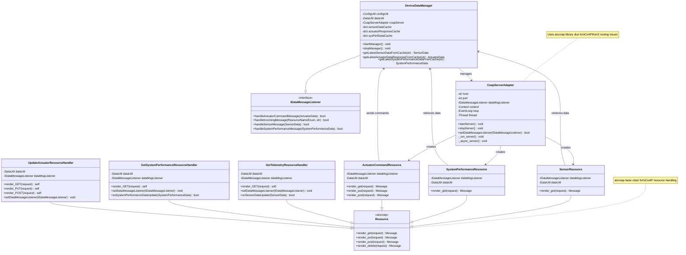

# Constrained Device Application (Connected Devices)

## Lab Module 08

Be sure to implement all the PIOT-CDA-* issues (requirements) listed at [PIOT-INF-08-001 - Lab Module 08](https://github.com/orgs/programming-the-iot/projects/1#column-10488501).

### Description

This implementation provides a fully functional CoAP server for the Constrained Device Application (CDA), enabling RESTful communication over the CoAP protocol for IoT device management. The solution implements a CoAP server adapter that exposes resources for sensor telemetry data retrieval, system performance monitoring, and actuator command processing. The server supports all standard CoAP methods (GET, PUT, POST, DELETE) and integrates seamlessly with the existing DeviceDataManager to provide real-time access to cached device data. Due to compatibility and routing issues encountered with the CoAPthon3 library (where incoming requests were received but not properly routed to resource handlers), the implementation utilizes the aiocoap library, which provides reliable asynchronous CoAP functionality with proper request handling and response generation.

The implementation works by creating resource handlers that extend from aiocoap's Resource class, each implementing render methods for the appropriate CoAP operations. The CoapServerAdapter initializes these resources (SensorResource, SystemPerformanceResource, and ActuatorCommandResource) and registers them at specific URI paths using aiocoap's resource tree structure. When the server starts, it runs an asynchronous event loop in a separate daemon thread to handle incoming CoAP requests without blocking the main application. Each resource handler connects to the DeviceDataManager through the IDataMessageListener interface, allowing them to retrieve cached sensor data, system metrics, and process actuator commands. The server successfully handles CoAP requests on port 5683, returning JSON-formatted payloads for telemetry data and processing incoming actuator commands with appropriate CoAP response codes (2.05 CONTENT for successful GET requests, 2.04 CHANGED for successful PUT operations).

### Code Repository and Branch

URL: https://github.com/danielkleebinder/python-components/tree/labmodule08

### UML Design Diagram(s)

### Unit Tests Executed

- ConfigUtilTest
- DataUtilTest
- ActuatorDataTest
- SensorDataTest
- SystemPerformanceDataTest
- SystemCpuUtilTaskTest
- SystemMemUtilTaskTest

### Integration Tests Executed

- CoapServerAdapterTest (Manual testing with Californium CoAP client)
  - Discovery test: `GET coap://localhost:5683/.well-known/core`
  - Sensor data retrieval: `GET coap://localhost:5683/sensor` (42 bytes returned)
  - System performance retrieval: `GET coap://localhost:5683/sysperf` (54 bytes returned)
  - Actuator status retrieval: `GET coap://localhost:5683/actuator` (40 bytes returned)
  - Actuator command submission: `PUT coap://localhost:5683/actuator` with JSON payload (31 bytes response)
- DeviceDataManagerTest
- SensorAdapterManagerTest
- ActuatorAdapterManagerTest
- SystemPerformanceManagerTest
- MqttClientConnectorTest

EOF.