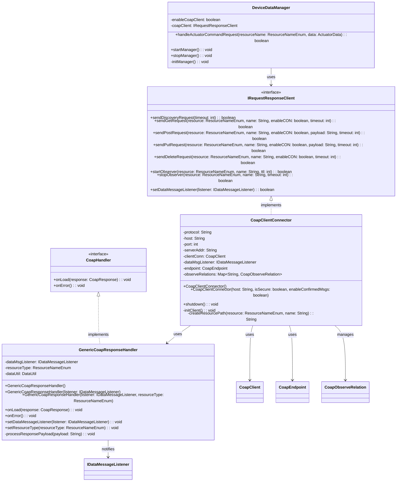
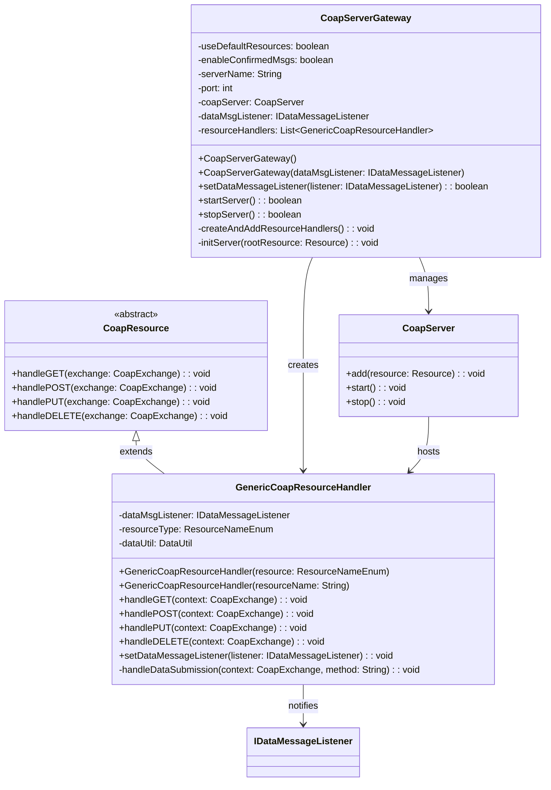

# Gateway Device Application (Connected Devices)

## Lab Module 09

Be sure to implement all the PIOT-GDA-* issues (requirements) listed at [PIOT-INF-09-001 - Lab Module 09](https://github.com/orgs/programming-the-iot/projects/1#column-10488503).

### Description

This implementation provides a comprehensive CoAP (Constrained Application Protocol) client and server infrastructure for the Gateway Device Application, enabling reliable machine-to-machine communication between the GDA and CDA. The implementation includes a fully functional CoAP client connector that supports all standard CoAP methods (GET, POST, PUT, DELETE), resource discovery through the .well-known/core mechanism, and asynchronous observation of resources using the CoAP observe pattern. Additionally, it includes a CoAP server gateway that can host resources and respond to incoming requests, making the GDA capable of both initiating requests to constrained devices and serving its own resources to other nodes in the IoT network.

The implementation leverages the Eclipse Californium 3.x framework to handle the CoAP protocol stack, with careful configuration management to avoid common initialization issues. The architecture follows a handler-based pattern where incoming CoAP responses and observations are processed through generic handlers that parse the payload based on resource type and delegate to appropriate data message listeners. The client maintains a shared endpoint for efficient resource utilization, tracks active observation relationships for proper lifecycle management, and provides both confirmable (CON) and non-confirmable (NON) message support based on QoS requirements. The server side uses a resource tree structure with observable resources that can notify subscribers of state changes, implementing the full RESTful paradigm over UDP transport.

### Code Repository and Branch

URL: https://github.com/[your-username]/gda-java-components/tree/[your-branch]

### UML Design Diagram(s)

#### CoAP Client Architecture

#### CoAP Server Architecture

### Unit Tests Executed

NOTE: Unit tests focus on individual component functionality without external dependencies.

-

### Integration Tests Executed

NOTE: Integration tests verify end-to-end functionality with actual CoAP communication.

- CoapClientPerformanceTest
- CoapDiscoveryTest

EOF.