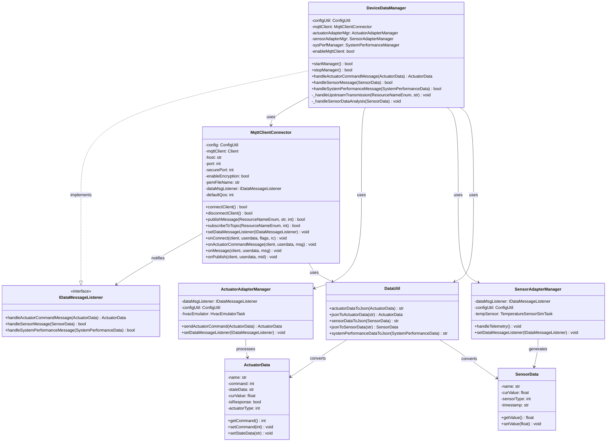

# Constrained Device Application (Connected Devices)

## Lab Module 10

Be sure to implement all the PIOT-CDA-* issues (requirements) listed at [PIOT-INF-10-001 - Lab Module 10](https://github.com/orgs/programming-the-iot/projects/1#column-10488510).

### Description

NOTE: Include two full paragraphs describing your implementation approach by answering the questions listed below.

What does your implementation do? 

This implementation establishes secure, bidirectional MQTT communication between the Constrained Device Application (CDA) and Gateway Device Application (GDA). The system enables the CDA to transmit sensor data and system performance metrics upstream to the GDA while simultaneously receiving and processing actuator commands downstream. Key features include TLS/SSL encryption support for MQTT communications on port 8883, comprehensive performance benchmarking for all three MQTT QoS levels (0, 1, 2), and an event-driven architecture that handles actuator commands through callback mechanisms. The implementation also includes automated threshold monitoring for temperature sensors that triggers HVAC actuator adjustments when floor or ceiling values are exceeded.

How does your implementation work?

The implementation works through a layered architecture where the DeviceDataManager orchestrates all communication flows between the CDA's internal components and the MQTT broker. For upstream data transmission, sensor readings and system performance metrics are collected by their respective adapter managers, converted to JSON format via DataUtil, and published to specific MQTT topics using the MqttClientConnector with configurable QoS levels. For downstream command reception, the MqttClientConnector subscribes to the CDA actuator command topic upon connection establishment and registers a topic-specific callback (onActuatorCommandMessage) that parses incoming JSON payloads into ActuatorData objects. These commands are then routed through the IDataMessageListener interface to the DeviceDataManager's handleActuatorCommandMessage method, which validates and forwards them to the ActuatorAdapterManager for execution. The system prevents deadlock conditions by removing blocking wait_for_publish calls and implementing asynchronous message handling, while TLS encryption is enabled through certificate configuration and SSL context setup using the ssl.PROTOCOL_TLS_CLIENT protocol.

### Code Repository and Branch

NOTE: Be sure to include the branch (e.g. https://github.com/programming-the-iot/python-components/tree/alpha001).

URL: https://github.com/programming-the-iot/python-components/tree/labmodule10

### UML Design Diagram(s)

NOTE: Include one or more UML designs representing your solution. It's expected each
diagram you provide will look similar to, but not the same as, its counterpart in the
book [Programming the IoT](https://learning.oreilly.com/library/view/programming-the-internet/9781492081401/).

### Unit Tests Executed

NOTE: TA's will execute your unit tests. You only need to list each test case below
(e.g. ConfigUtilTest, DataUtilTest, etc). Be sure to include all previous tests, too,
since you need to ensure you haven't introduced regressions.

- MqttClientConnectorTest
- ActuatorDataTest
- SensorDataTest
- DataUtilTest

### Integration Tests Executed

NOTE: TA's will execute most of your integration tests using their own environment, with
some exceptions (such as your cloud connectivity tests). In such cases, they'll review
your code to ensure it's correct. As for the tests you execute, you only need to list each
test case below (e.g. SensorSimAdapterManagerTest, DeviceDataManagerTest, etc.)

- MqttClientConnectorTest (testActuatorCmdPubSub)
- MqttClientPerformanceTest (testPublishQoS0, testPublishQoS1, testPublishQoS2, testConnectAndDisconnect)
- DeviceDataManagerCallbackTest (testActuatorDataCallback)
- DeviceDataManagerIntegrationTest (testDeviceDataMgrTimedIntegration)

EOF.