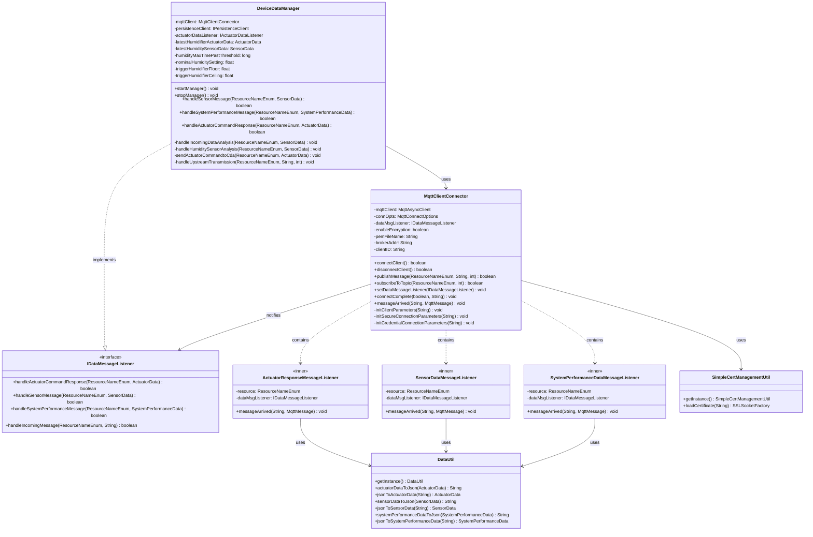

# Gateway Device Application (Connected Devices)

## Lab Module 10

Be sure to implement all the PIOT-GDA-* issues (requirements) listed at [PIOT-INF-10-001 - Lab Module 10](https://github.com/orgs/programming-the-iot/projects/1#column-10488510).

### Description

NOTE: Include two full paragraphs describing your implementation approach by answering the questions listed below.

What does your implementation do? 

This implementation establishes the Gateway Device Application as a central hub for edge intelligence and cloud connectivity in the IoT ecosystem. The GDA receives sensor data and system performance metrics from the Constrained Device Application via MQTT subscriptions, processes this data through threshold analysis algorithms, and generates appropriate actuator commands when environmental conditions exceed configured boundaries. Key features include TLS/SSL encryption support for secure MQTT communications, asynchronous message handling using MqttAsyncClient to prevent deadlock conditions, and intelligent humidity control logic that triggers humidifier actuation based on time-series analysis of sensor readings. The system also implements the IDataMessageListener interface to handle three distinct message types from the CDA: SensorData for environmental monitoring, SystemPerformanceData for device health tracking, and ActuatorData responses for command acknowledgment.

How does your implementation work?

The implementation operates through an event-driven architecture where the MqttClientConnector uses the MqttAsyncClient to maintain non-blocking bidirectional communication with both the CDA and cloud services. Upon connection to the MQTT broker, the connectComplete callback automatically subscribes to CDA topics using IMqttMessageListener implementations for each message type, ensuring proper deserialization and routing through the DeviceDataManager. When humidity sensor data arrives, the handleIncomingDataAnalysis method performs time-series analysis by tracking threshold violations over a configurable time window (default 300 seconds), preventing false triggers from transient spikes. If humidity levels remain outside the acceptable range (30-50% relative humidity) for the specified duration, the GDA generates an ActuatorData command with the appropriate ON/OFF state and publishes it to the CDA's actuator command topic. The system maintains state tracking through class-scoped variables that store the latest sensor readings, timestamps, and actuator commands, enabling intelligent decision-making based on historical context. TLS encryption is configured through certificate management utilities that load PEM files and establish secure socket connections on port 8883, while credential-based authentication can be optionally enabled through separate configuration files.

### Code Repository and Branch

NOTE: Be sure to include the branch (e.g. https://github.com/programming-the-iot/java-components/tree/alpha001).

URL: https://github.com/programming-the-iot/java-components/tree/labmodule10

### UML Design Diagram(s)

NOTE: Include one or more UML designs representing your solution. It's expected each
diagram you provide will look similar to, but not the same as, its counterpart in the
book [Programming the IoT](https://learning.oreilly.com/library/view/programming-the-internet/9781492081401/).

### Unit Tests Executed

NOTE: TA's will execute your unit tests. You only need to list each test case below
(e.g. ConfigUtilTest, DataUtilTest, etc). Be sure to include all previous tests, too,
since you need to ensure you haven't introduced regressions.

### Integration Tests Executed

NOTE: TA's will execute most of your integration tests using their own environment, with
some exceptions (such as your cloud connectivity tests). In such cases, they'll review
your code to ensure it's correct. As for the tests you execute, you only need to list each
test case below (e.g. SensorSimAdapterManagerTest, DeviceDataManagerTest, etc.)

- MqttClientConnectorTest (testConnectAndDisconnect, testActuatorCommandResponseSubscription)
- MqttClientPerformanceTest (testPublishQoS0, testPublishQoS1, testPublishQoS2)
- DeviceDataManagerSimpleCdaActuationTest (testSendActuationEventsToCda)

EOF.