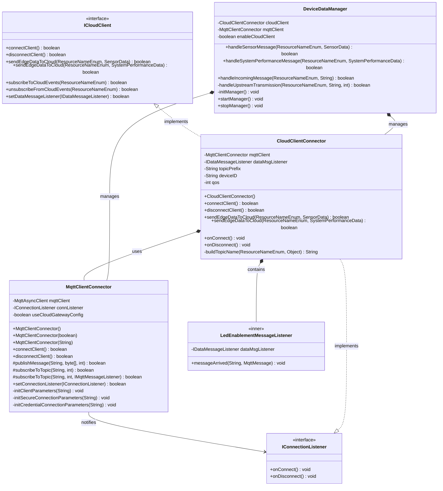

# Gateway Device Application (Connected Devices)

## Lab Module 11

Be sure to implement all the PIOT-GDA-* issues (requirements) listed at [PIOT-INF-11-001 - Lab Module 11](https://github.com/orgs/programming-the-iot/projects/1#column-10488514).

### Description

My implementation extends the Gateway Device Application (GDA) to support cloud connectivity through Ubidots, enabling bi-directional communication between edge devices and cloud services. The implementation adds a CloudClientConnector that wraps the enhanced MqttClientConnector to handle cloud-specific MQTT communication patterns, including authentication via API tokens, SSL/TLS encryption, and Ubidots-specific topic structures. The system now supports end-to-end data flow from the Constrained Device Application (CDA) through the GDA to Ubidots, where sensor data (temperature, humidity, pressure) and system performance metrics are stored and visualized, while cloud-based rules can trigger actuator commands (LED control) that flow back through the GDA to the CDA.

The implementation works by utilizing a dual MQTT architecture where the MqttClientConnector can be configured for either local broker communication or cloud service connectivity. When configured for cloud use, it loads credentials from a properties file containing the Ubidots API token, establishes an SSL-encrypted connection to industrial.api.ubidots.com, and handles the authentication by setting the token as the MQTT username. The CloudClientConnector implements the ICloudClient interface and IConnectionListener to manage the cloud connection lifecycle, automatically subscribing to LED actuator command topics upon successful connection. Data transformation occurs in the CloudClientConnector to convert from the internal IoT data format to Ubidots' expected JSON structure, ensuring proper variable creation and data persistence in the cloud platform.

### Code Repository and Branch

URL: https://github.com/programming-the-iot/java-components/tree/lab11-cloud-integration

### UML Design Diagram(s)

### Unit Tests Executed

NOTE: TA's will execute your unit tests. You only need to list each test case below
(e.g. ConfigUtilTest, DataUtilTest, etc). Be sure to include all previous tests, too,
since you need to ensure you haven't introduced regressions.

- 

### Integration Tests Executed

NOTE: TA's will execute most of your integration tests using their own environment, with
some exceptions (such as your cloud connectivity tests). In such cases, they'll review
your code to ensure it's correct. As for the tests you execute, you only need to list each
test case below (e.g. SensorSimAdapterManagerTest, DeviceDataManagerTest, etc.)

- MqttClientConnectorTest
- CloudClientConnectorTest
- GatewayDeviceApp
- end-to-end pipeline

EOF.