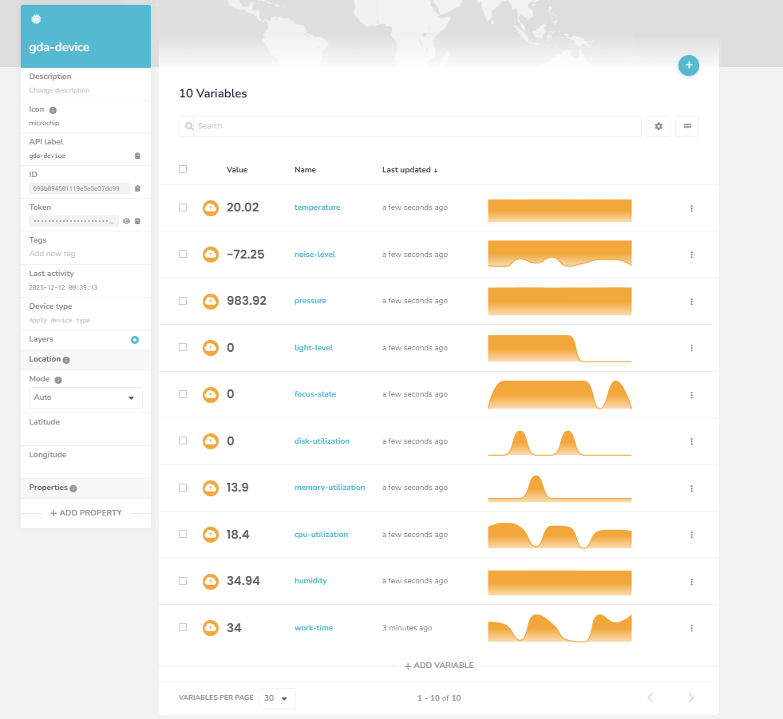
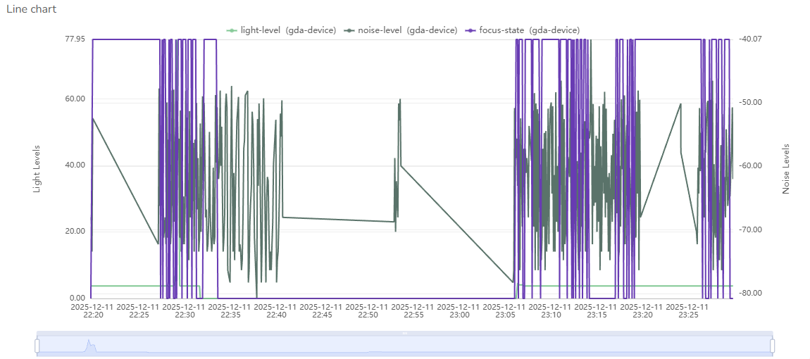
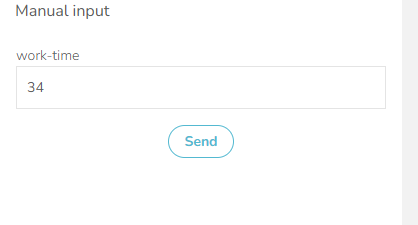
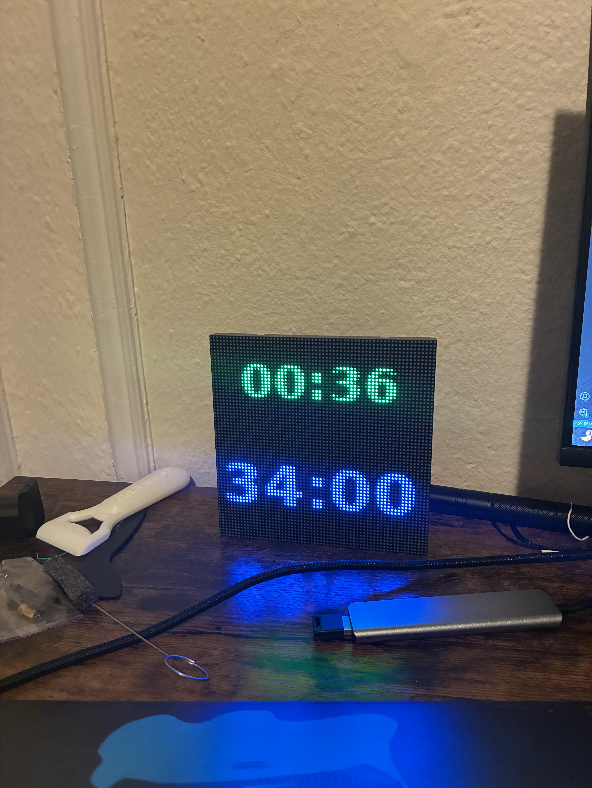

# Lab Module 12 - Semester Project - Final Write-up

NOTE: Be sure to implement all the Lab Module 12 requirements listed at [Lab Module 12](https://github.com/orgs/programming-the-iot/projects/1#column-10488565).

## Description

I am building a desk assistant to help with task management and engagement during work sessions. The product will clearly display a countdown timer and to-do list on an LED matrix panel, and track attention via computer vision. When it detects you are distracted, the LED matrix will gently remind you to return to the task at hand. In addition to helping users stay engaged session to session, the system will also track noise and light levels in the environment, when paired with data on engagement vs. non-engagement, this can uncover trends or patterns into what environments bring out the most amount of concentration from the user so that they can better design and tune their work environment for maximum focus.

## What - The Problem
I am trying to solve 2 problems simultaneously with this project. The first one is that within working sessions, it is very easy for me to get distracted and off task by going on my phone, or talking to my friend with whom I share an office. If I do not remember to return on task, inertia will quickly set in and I am likely to burn as much as 20 minutes on nothing, and this kind of thing can happen many times in one work session. The presence of the LED matrix allows for a very clear signpost in my environment, that would be hard to ignore. This signpost will enable me to always know exactly what tasks I need to get done by displaying text, and my robust control of it will enable me to make it very hard to ignore when I am off track. Additionally, the timer feature helps me commit to focused work sessions by counting down only during engaged time, ensuring I actually complete my planned work blocks.
The second problem I am trying to solve is that of not knowing the correlation between engagement levels and environment. I often find myself trying to work in whatever environment I find myself in, but by measuring things like noise levels and light levels, and plotting them against points where I am distracted, I can discover how to keep myself engaged with something in the long term.

## Why - Who Cares?
As someone who struggled my whole life with forgetfulness and staying focused, in class, at work, doing homework, even watching TV and movies, I always find myself looking for a second source of input. I have spent a lot of effort trying to hack things like my ability to wake up in the morning, or remember what to eat for lunch, etc. This project is another one in this chain of focus and productivity oriented solutions. By implementing this, I will give my desk power over me. I will give it the intelligence to be able to realize when I'm off task, and the brightness to tell me: "DANIEL GET BACK TO WORK". I will give my desk the ability to track my work sessions and only count down the timer when I'm actually focused, so I can't cheat my way through a work block. Aside from me, I think this project would be helpful to anyone who wishes they had more control over their own behaviors when doing work and does not know how to design their environment for maximum focus.

## How - Expected Technical Approach

How do you plan to tackle this problem technically?

Include a high-level design diagram depicting your planned technical approach - it does not need to be final, but it must include the CDA, GDA, and cloud services you plan to use, as well as the protocol(s) you will use for communicating between the devices and the cloud.

Write 1 to 2 paragraphs describing your diagram.

My solution will involve the following sensors: a microphone for measuring ambient noise levels, a camera for tracking engagement, and a light level sensor for picking up long term patterns. The actuator will be a 64x64 LED matrix, which will let me display a work timer, tell me when to get back to work, as well as anything else I may find useful when testing and developing this project. The LED matrix is controlled by an ESP32-S3 which will be connected to my CDA. The CDA will send json payloads with instructions through HTTP post requests. The CDA also connects to the GDA through MQTT, and sends over readings for noise levels and light levels. In order to determine my focus, I will use a YOLO computer vision model for face detection and phone detection, if it can detect my face and no phone, it will assume I am looking at my computer and working. Since the key metric is just my attention state, for efficiency and simplicity I will not actually be transmitting my frames from the CDA, and will only transmit if there is a state change. This way for visualization, I can plot out the 2 lines (noise and light levels) over time and overlay the states of whether I am focused or not. Additionally, if I am not focused an actuation event will be sent to the matrix to blare red to get me to focus again. For persistence data will be stored in a local file system on my Pi, through the GDA. It will also be sent to the cloud so that I can monitor my own focus trends on the go. Additionally, the cloud can be used to set work timer durations - when a timer value is entered in Ubidots, it gets sent down to my GDA then my CDA, where the LED matrix displays a countdown that only decrements during focused work time.

### What THREE (3) sensors and ONE (1) actuator did you use (add more if you wish)?

- CDA Sensor 1: 
    microphone for detecting noise levels
- CDA Sensor 2: 
    camera for tracking user focus
- CDA Sensor 3: 
    color sensor for detecting brightness
- CDA Actuator 1: 
    led matrix screen for feedback to user

### What ONE (1) CDA protocol and TWO (2) GDA protocols did you implement (add more if you wish)?

- CDA to GDA Protocol: 
    mqtt
- GDA to CDA Protocol: 
    mqtt
- GDA to Cloud Protocol: 
    mqtt
- Cloud to GDA Protocol: 
    mqtt
-CDA to ESP32 Matrix Controller:
    http

 
### What TWO (2) cloud services / capabilities did you use (add more if you wish)?

- Cloud Service 1 (data ingress - all inputs):
    I used Ubidots to recieve and plot the collected data
- Cloud Service 2 (data egress - all actuation events):
    I used a ubidots input field to set the timer which sends it all the way back to the matrix screen

## Screen Shots Representing Cloud Services

### Screen Shots Representing Visualized Data

NOTE: Include (at least) TWO (2) screen shots - one showing at least 1 hour
of time-series data from the CDA, and one showing an event being triggered
that results in an actuation event sent to your GDA and then to your CDA.

EOF.
