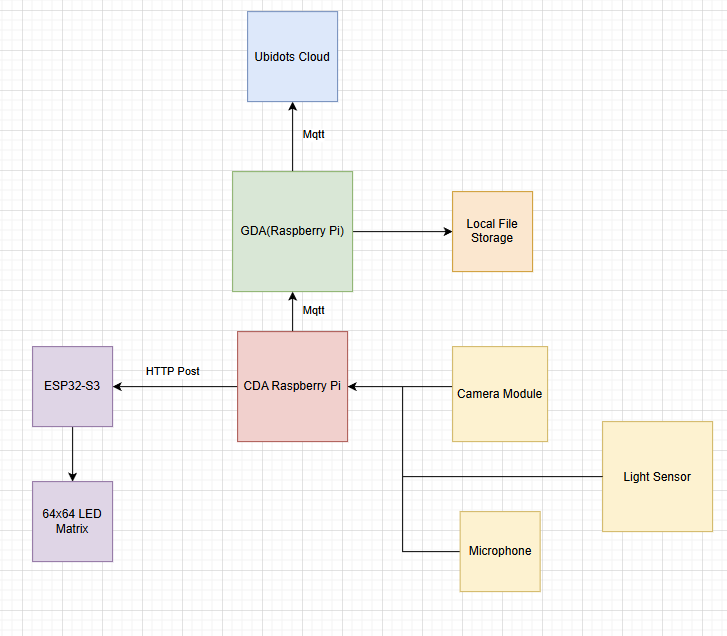

# Lab Module 12 - Semester Project Proposal

## Description

Describe your idea in 1 paragraph (at least 2 or 3 sentences).

I am building a desk assitant to help with task management and engagement during work sessions. The product will clearly display a to-do list on an led matrix panel, save voice notes for future reflection/processing, and track attention via computer vision. When it detects you are distracted, the led matrix will gently remind you to return to the task at hand. In addition to helping users stay engaged session to session, the system will also track noise and light levels in the environment, when paired with data on engagement vs. non engagement, this can uncover trends or pattern into what environments bring out the most amount of concentraion from the user so that they can better design and tune their work environment for maximum focus. 

## What - The Problem 

What problem are you trying to solve and why does it matter? Write 1 to 2 paragraphs in response.

I am trying to solve 2 problems simultaneously with this project. The first one is that within working sessions, it is very for me to get distracted and off task by going on my phone, or talking to my friend with whom I share an office. If I do not remember to return on task, inertia will quickly set in and I am likely to burn as much as 20 minutes on nothing, and this kind of thing can happen many times in one work session. The presence of the LED matrix allows for a very clear signpost in my environment, that would be hard to ignore. This signpost will enable me to always know exactly what tasks I need to get done by displaying text, and my robust control of it will enable me to make it very hard to ignore when I am off track. 

The second problem I am trying to solve is that of not knowing the correlation between engagement levels and environment.  I often find myself trying to work in whatever environment I find myself in, but by measuring things like noise levels and light levels, and plotting them against points where I am distracted, I can discover how to keep myself engaged with someone in the long term. 

## Why - Who Cares? 

Why do you care about this particular problem? Write 1 to 2 paragraphs in response.

As someone who struggled my whole life with forgettfulness and staying focused, in class, at work, doing homework, even watching TV and movies, I always find myself looking for a second source of input. I have spent a lot of effort trying to hack things like my ability to wake up in the morning, or remember what to eat for lunch, etc. This project is another one in this chain of focus and productivity oriented solutions. By implmenting this, I will give my desk power over me. I will give it the intelligence to be able to realize when im off task, and the brightness to tell me: "DANIEL GET BACK TO WORK". I will give my desk the memory to remember what I have done and said, so that I dont need to risk a distraction event by taking the note manually. Aside from me, I think this project would be helpful to anyone who wishes they had more control over their own behaviors when doing work and does not know how to design their environment for maximum focus. 

## How - Expected Technical Approach

How do you plan to tackle this problem technically?

Include a high-level design diagram depicting your planned technical approach - it does not need to be final, but it must include the CDA, GDA, and cloud services you plan to use, as well as the protocol(s) you will use for communicating between the devices and the cloud.

Write 1 to 2 paragraphs describing your diagram.

My solution will involve the following sensors: a microphone for recording audio as well as noise levels, a camera for tracking engagement, and a light level sensor for picking up long term patterns. The actuator will be a 64x64 LED matrix, which will let me display to do lists, tell me when to get back to work, as well as anything else I may find useful when testing and developing this project. The LED matrix is controlled by an ESP32-S3 which will be connected to my CDA. The CDA will send json payloads with instructions through HTTP post requests. The CDA also connects to the GDA through mqtt, and sends over readings for noise levels and light levels as well as transcribed audio using Vosk. In order to determine my focus, I will use a YOLO computer vision model for face detection and phone detection, if it can detect my face and no phone, it will assume I am looking at my comptuer and working.  Since the key metric is just my attention state, for efficiency and simplicity I will not actually be transmitting my frames from the CDA, and will only transmit if there is a state change. This way for visualization, I can plot out the 2 lines(noise and light levels) over time and overlay the states of whether I am focused or not. Additionally, if I am not focused an actuation event will be sent to the matrix to blare red to get me to focus again. For persistance data will be stored in a local file system on my Pi, through the GDA. It will also be sent to the cloud so that I can monitor my own focus trends on the go. Additionally, the cloud will have a field where I can enter action items, the list of action items will populate the LED matrix on startup by sending the values down to my GDA then my CDA.

## Results - Expected Outcomes 

If your project is successful, what outcome do you expect (e.g. what will happen if everything works)? Write 1 to 2 paragraphs describing your expected outcomes.

If my project is successful, in the immediate I would expect myself to have more efficient work sessions, I would still have distractions but I would bounce back from them quickly and complete my work faster with better actions. In the long term, I will grow aware of my own habits based on how I react to noise and light, and I will then be able to plan out and edit my space, for example maybe I would lower or raise my shades, or wear headphones when working, these things will slowly change my patterns and focus levels.

EOF.
